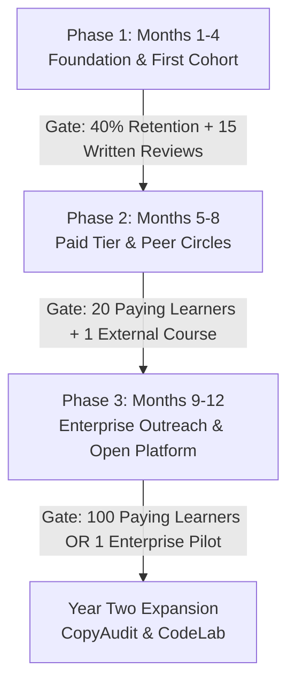

# AMASAMYA: Inclusive Technology and Professional Learning Platform
### *A Strategic Proposal & Master Execution Blueprint for Equal Opportunity in Tech, Language, and Career Empowerment*

**Platform & Academy Leadership:**
*   **Akhilesh Malani** - *Founder & Creator, AMASAMYA | Lead, School of Technology & Accessibility Engineering*  
    Enterprise Accessibility Architect with 16+ years of experience across Google, Bank of Montreal, Dun & Bradstreet, and Oracle Financial Services. Creator of the AMASAMYA accessibility audit suite across Android, Web, and Browser Extensions (v5.3). Author of the VPAT 2.4 ACR generator, GIGW 3.0, and IS 17802 India-national audit engines.
*   **L. Subramani** - *Founding Academic Director, AMASAMYA Academy | Lead, School of English & Professional Communication*  
    Veteran journalist with 28+ years of experience including Chief Copy Editor at *Deccan Herald*, acclaimed author of *"Lights Out"*, communications strategist, and disability advocate who has mastered executive English communication as a visually impaired leader.

**Date:** August 2026  
**Document Version:** 2.1 (*Platform & Academy Master Plan*)  
**Status:** Confidential / Internal Strategic Blueprint

---

## 1. Executive Vision and Core Mission

The mission of the **AMASAMYA** platform is to create a barrier-free ecosystem where persons with disabilities and mainstream learners build professional English and accessibility engineering skills side by side, taught by educators who navigate the digital world using the exact same assistive technology stack as the learners.

AMASAMYA is founded and engineered by Akhilesh Malani as an overarching accessibility technology ecosystem. Within this ecosystem, AMASAMYA Academy is co-led in academic partnership with L. Subramani to provide rigorous, executive-level language and professional communication training.

Accessibility here extends far beyond software code audits and regulatory compliance checklists. It is the core architecture of the platform, the pedagogy, the authoring tools, and the certification pathway. Every learner completing the AMASAMYA program acquires two foundational assets:
1.  **Measurable Executive-English Fluency:** Corporate-grade written and spoken communication ability tailored for multinational and executive workplaces.
2.  **A Marketable Technical Identity:** Verifiable proficiency in accessibility engineering, standards compliance (WCAG 2.2, GIGW 3.0, IS 17802), or accessible content creation.

---

## 2. Market Landscape and Strategic Gap Analysis

The four primary learner segments served by AMASAMYA are currently unserved on the critical dimensions this platform addresses:

| Target Segment | Current Available Solutions & Limitations | The AMASAMYA Advantage |
| :--- | :--- | :--- |
| **Blind Adults preparing for corporate English roles** | **Duolingo, Grammarly, ELSA:** Heavily visually driven (drag-and-drop, visual cues, video-first). None deliver corporate-register writing coaching; none are usable end to end with a screen reader. | Audio-first, screen-reader native pedagogy curated by L. Subramani. Focuses directly on business writing, nuance, and verbal workplace fluency. |
| **Blind Educators authoring accessible courses** | **Canvas, Moodle, Coursera authoring tools:** Authoring interfaces are visual-first. Blind teachers cannot independently create, structure, or publish courses without sighted assistance. | Accessible audio-first authoring dashboard. Non-visual workflow with ARIA live region announcements, keyboard shortcuts, and simple quiz builders. |
| **Accessibility Engineers seeking Indian standards training** | **Deque University, W3C WAI:** Prohibitively priced ($150 to $300 USD per course). English-only; zero coverage of GIGW 3.0, IS 17802, or the SEBI accessibility mandates Indian employers are hiring against. | Affordable domestic INR pricing, integrated real-world audit exercises, full coverage of Indian national standards alongside global WCAG 2.2 benchmarks. |
| **Indian Government & Enterprise DEI Programs** | **DIKSHA, SWAYAM, Sugamya Pustakalaya:** High volume of content, but relies heavily on inaccessible PDFs, image-only quizzes, and uncaptioned video. No interactive labs. | Certified accessible LMS environment, interactive technical labs, and verifiable compliance reporting (VPAT 2.4 ACR). |

---

## 3. What We Build in Year One vs. What We Deliberately Defer

To maintain flawless execution and prevent premature over-engineering, Version 2.1 strictly isolates Year One around core pedagogical proof and accessible infrastructure.

### Year-One Scope (v1): Core Pedagogical & Delivery Engines

#### **Pillar 1: School of English and Professional Communication (Subramani-led)**
*   **Track A: English Foundations:** Phonics, sentence construction, tense consistency, vocabulary expansion, screen-reader friendly grammar drills, listening comprehension.
*   **Track B: Professional and Corporate Writing:** Business email writing, executive status reports, technical documentation, copyediting, and jargon elimination.
*   **Track C: Executive Verbal Fluency:** Public speaking, meeting leadership, voice modulation, pacing, and interview mastery.
*   **Track D: Journalism and Content Craft:** Long-form feature writing, opinion pieces, accessible alt-text authoring, and digital advocacy storytelling.

#### **Pillar 4a: Accessible LMS Learner Surface & Blind-Educator Audio-First Authoring**
*   **Learner Surface:** Full keyboard-only navigation, high-contrast palette, ARIA live region optimization, audio-first lesson streaming, and screen-reader optimized reading views.
*   **Educator Authoring Tool:** Accessible audio-recording, lesson upload, and quiz-authoring interface that a blind educator can operate independently without sighted assistance.

> **The Pedagogical Bridge (Audio-to-Text Workflow):**  
> While lessons are delivered audio-first, writing mastery requires granular text interaction. Track B and D exercises follow a tight, structured loop:
> 1. **Listen** to audio micro-lecture and explanation of principles.
> 2. **Navigate** accessible markdown text models and identify structural patterns.
> 3. **Draft** responses in an accessible web editor with full keyboard navigation.
> 4. **Receive** structured rubric feedback from peer review circles and instructor office hours.

---

### Year-Two Scope (v2): Scaled Automation & Interactive Sandboxes

*   **Pillar 3: AMASAMYA CopyAudit Engine:** Automated readability, grammar, tone, and clarity evaluation engine. Deferred to Year Two because the underlying pedagogical rules established by L. Subramani in Year One must be proven first.
*   **Pillar 2b: AMASAMYA CodeLab:** Browser sandbox for live code with instant screen-reader utterance simulation. Deferred because Year One engineering tracks can be effectively delivered via existing extension audits, lectures, and live code remediation exercises.

---

### Out of Year-One Scope Entirely

*   **Indic Regional Language Learning Paths:** Tamil, Hindi, Marathi, and other regional language content require native-speaker instructors, script-specific screen reader QA, and cultural localization. Scheduled as a v3 milestone post Year-One traction.
*   **Full B2B Enterprise Sales Motion:** Enterprise sales cycles span 6 to 18 months in India. Year One does not depend on enterprise revenue; corporate conversations begin in Month 10 for Year Two close.

---

## 4. Twelve-Month Roadmap with Explicit Gate Conditions

Progression between phases is governed by strict numeric gate conditions. If a gate is not met, the leadership iterates the current phase rather than expanding prematurely.

### Phase 1 (Months 1 to 4): Foundation, First Cohort & Curriculum Lock
*   Curriculum outline for Tracks A and B finalized and recorded by L. Subramani (initial 8 audio lessons).
*   LMS learner surface deployed; educator authoring interface at functional MVP.
*   Enrolment of **Cohort 1: 30 verified blind learners** sourced via the AMASAMYA browser extension and partnered disability organizations (with advanced placement testing for learners skipping Track A into Track B).
*   **Gate to Phase 2:** First cohort reaches Level 2 completion with at least **40% retention (12 of 30 learners)** and written curriculum feedback submitted by at least **15 learners**.

### Phase 2 (Months 5 to 8): Tracks C & D, Paid Tier & Peer Review Circles
*   Tracks C (Verbal Fluency) and D (Journalism & Content Craft) recorded and published.
*   Paid tier launches with introductory pricing (**INR 999 per month**).
*   Enrolment of **Cohort 2: Target 100 learners** across free and paid tiers combined.
*   Launch of moderated **Peer Writing & Review Circles** to scale assignment evaluations without bottlenecking instructor bandwidth.
*   Blind educator co-design program: **3 external blind educators** onboarded to test and author via the platform.
*   **Gate to Phase 3:** At least **20 active paying learners** AND at least **1 external blind educator** successfully publishes a course through the authoring tool.

### Phase 3 (Months 9 to 12): Institutional Scale & Educator Platform Launch
*   Enterprise DEI outreach begins: Target **5 qualified enterprise conversations, 1 signed pilot**.
*   Authoring tool moves out of beta and opens to verified community educators.
*   Institutional partnership discussions initiated with **3 Indian universities and 2 blind schools**.
*   Introduce **Corporate / CSR Sponsor-a-Scholar** model for enterprise recruitment pipelines.
*   Technical and pedagogical scoping for Year Two engines (CopyAudit & CodeLab).
*   **Gate to Year Two:** **100 active paying learners** OR **1 signed enterprise pilot** OR **2 signed institutional partnerships**.

---

## 5. Monetisation Model & Financial Sustainability

The platform combines community affordability with enterprise and institutional revenue streams. The foundational tier remains permanently free to preserve access for those who cannot pay.

*   **Free Community Tier:** Track A (Foundations) plus Module 1 of Track B. Fully accessible LMS access with no time limit. Subsidized by paid tiers and corporate sponsorships.
*   **Individual Paid Tier:** Complete Tracks A through D + certification pathway + peer circle participation. Target price **INR 999 per month** or **INR 8,999 per year** (deliberately priced below foreign platforms like Deque to suit Indian professionals).
*   **Corporate / CSR "Sponsor-a-Scholar" Tier:** Bulk licenses for corporate DEI hiring pipelines and accessibility engineering upskilling. Target **INR 2 to 5 Lakhs per organization per year** (includes up to 25 learners plus hiring pipeline visibility).
*   **Institutional Tier:** Discounted, cost-recovery volume pricing for universities, special schools, and NGO training centers.
*   **Grant Funding:** Pursue non-dilutive assistive technology and disability empowerment grants to underwrite regional language expansion in Year Two.

---

## 6. Governance, Intellectual Property, and Leadership Structure

*   **Master Entity & Ownership:** AMASAMYA is owned and founded by Akhilesh Malani. The legal entity holding the master brand, website, and technology is owned 100% by Akhilesh Malani.
*   **Software IP Ownership:** All AMASAMYA software IP (browser extensions, Android app, web audit engine, VPAT ACR generator, CodeLab, and platform source code) remains the exclusive, undiluted property of Akhilesh Malani.
*   **Academy Leadership & Academic Partnership:** L. Subramani joins as Founding Academic Director of AMASAMYA Academy and Academic Lead for the School of English and Professional Communication. Course content authored by Subramani is licensed to AMASAMYA under a primary academic partnership.
*   **Commercial Revenue Sharing:** Revenue generated from Academy student subscriptions, corporate DEI communication licenses, and institutional curriculum packages is shared equitably between Akhilesh Malani and L. Subramani following direct platform infrastructure expenses.
*   **Joint Certification Credibility:** Course completion certificates issued by the Academy are co-signed by both Akhilesh Malani and L. Subramani, providing learners with combined validation from enterprise accessibility engineering and senior journalism.

---

## 7. Regulatory Posture & Trust Compliance

*   **Digital Personal Data Protection Act 2023 (DPDP):** Year One enrolment is restricted to adults (18+) to eliminate minor-consent regulatory overhead. Full digital consent and explicit data privacy terms implemented on the portal.
*   **Education Sector Regulations:** Marketing will strictly position credentials as *"Certificates of Professional Completion"* rather than university degrees or diplomas, maintaining compliance with UGC and AICTE ed-tech guidelines.
*   **Accessibility Assurance:** Full compliance with RPwD Act 2016, WCAG 2.2 AA, and GIGW 3.0. The platform's own Accessibility Conformance Report (VPAT 2.4 ACR) will be published openly in Phase 1 as an unassailable trust signal.

---

## 8. Year-One Extended Team & Budget Estimates

Year One operates on a lean, contractor-based model without full-time payroll overhead:

*   **Legal & Compliance Counsel:** Partnership agreement, licensing draft, DPDP consent review (~INR 1,00,000 over Phase 1).
*   **Accessible Audio Production Engineer:** Professional audio mastering and acoustic balancing for the first 20 core audio lessons (~INR 50,000 to 1,00,000).
*   **Independent Accessibility QA Reviewer:** External third-party blind accessibility auditor to conduct independent monthly conformance audits (~INR 15,000 per audit cycle).
*   **Community & Peer Circle Lead:** Part-time manager to guide peer writing circles, learner onboarding, and community forums starting in Phase 2 (~INR 25,000 to 40,000 per month).
*   **Contract Educator Co-Design Lead:** Honorarium for first blind educator to author and publish a 20-lesson co-design test course in Phase 2 (~INR 75,000).

---

## 9. Risk Register & Proactive Mitigations

| Risk | Severity | Proactive Mitigation |
| :--- | :--- | :--- |
| **Learner Drop-off Below 40% Gate** | Medium | Conduct mid-Phase 1 qualitative check-ins; introduce buddy and peer accountability systems to catch curriculum friction early. |
| **Educator Authoring Tool UX Complexity** | High | Keep Phase 1 tool constrained to a clean, non-visual audio recorder plus MCQ/short-answer quiz builder before expanding features. |
| **Sourcing Phase 1 Learners** | Medium | Combine extension marketing with targeted outreach via National Association for the Blind (NAB), XRCVC, and disability networks. |
| **Instructor Feedback Bottleneck** | High | Introduce structured self-evaluation rubrics and peer review circles, keeping instructor review focused on capstone milestone submissions. |
| **Founder Key-Person Dependency** | Medium | Maintain documented curricula and operational playbooks from Day 1; designate trusted domain advisors per pillar. |

---

## 10. Discussion Prompts for L. Subramani (Feedback & Alignment)

To finalize Phase 1 curriculum production and educator workflows, your specific insights on the following five focal points are requested:

### **Prompt 1: Curriculum Sequencing & Fast-Track Assessment**
> *Does the proposed four-track structure (Foundations -> Corporate Writing -> Executive Verbal Fluency -> Journalism/Advocacy) align with your pedagogical approach? How should we structure an entry-level assessment that allows advanced screen-reader users to skip Track A and enter directly into Track B?*

### **Prompt 2: Audio-First Lesson Length & Pedagogical Structure**
> *For visually impaired adults learning professional English, what lesson duration and cadence have proven most effective in your experience? (e.g. 5-minute focused micro-lessons with drills vs. 20-minute comprehensive lecture masterclasses).*

### **Prompt 3: The Audio-to-Text Writing Bridge**
> *When teaching corporate writing (emails, summaries, reports), how should audio instruction connect to text editing for screen reader users? What specific text exercises (e.g. editing intentional errors, rewriting ambiguous memos) should students complete?*

### **Prompt 4: Copyediting Rubrics & Early CopyAudit Heuristics**
> *When you copyedit student work, what are the top 3 to 5 common errors or habits you look for first (e.g. passive voice overuse, vague phrasing, structural clutter)? Defining these rules will serve as the exact blueprint for our Year Two CopyAudit engine.*

### **Prompt 5: Peer Circles & Scalable Evaluation Mechanics**
> *How can we best structure peer writing circles so that learners give and receive meaningful feedback on business writing without requiring you to manually line-edit every submission as cohorts expand?*

---

## 11. Immediate Next Steps & Phase 1 Kick-Off

1.  **Leadership Alignment:** L. Subramani reviews this Version 2.1 blueprint and shares feedback on Section 10 prompts.
2.  **Curriculum Lock:** Finalize syllabus and scripts for the initial 8 audio lessons across Tracks A and B.
3.  **Web Platform MVP Deployment:** Deploy MVP student portal, audio player, and educator authoring interface on the web.
4.  **Cohort 1 Enrolment:** Open applications for Cohort 1 (30 verified blind learners) and kick off Phase 1.

---
*Note: This document is a strategic proposal, not a legal instrument. Section 6 items require independent legal counsel before signature.*
